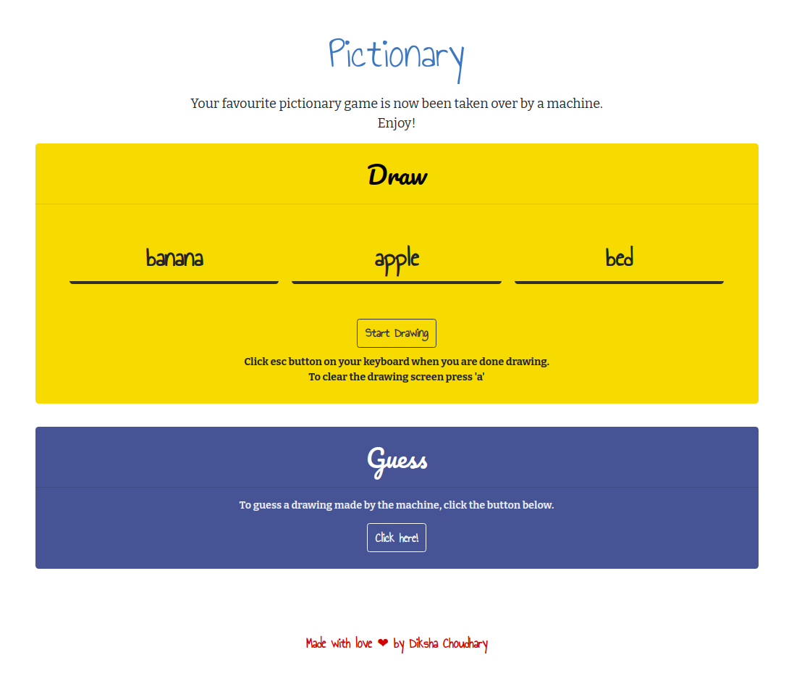

# Pictionary
_A real-time pictionary game against a bot._

## Get Started!

If you want to get this running and use the pre-trained model - my_model2.h5, type the following commands
```shell
export FLASK_APP=main.py
flask run
```

**Dependencies:**
* OpenCV (`pip install opencv-python`)
* Pandas (`pip install pandas==0.22`)

## Screenshot


## Load and Train your own data!

Refer to the 'loadData_train.ipynb' for loading the data and training the neural network.

This model was trained on 40k images per pre-processed(full_......npy) file for the following classes:
1. Alarm clock
2. Bicycle
3. Bed
4. Airplane
5. Apple
6. Belt
7. Banana
8. Cake
The deep learning model has 2 convolutional layers and 1 GRU layer based on [1].

## References

1. Xu, P., Song, Z., Yin, Q., Song, Y., & Wang, L. (2020). Deep Self-Supervised Representation Learning for Free-Hand Sketch. IEEE Transactions on Circuits and Systems for Video Technology, 1-1. doi:10.1109/tcsvt.2020.3003048

2. [The Quick, Draw! Dataset](https://github.com/googlecreativelab/quickdraw-dataset)

## Author
**Diksha Choudhary**
Email: diksha2.choudhary83@gmail.com
